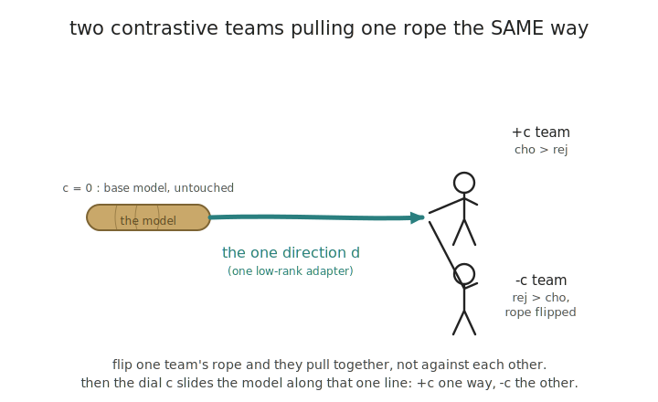

# cwsteer — contrastive weight steering

A small library for steering a language model along a contrastive axis by editing
its weights. It fits one conditioned adapter on (chosen, rejected) completion
pairs, calibrates the steering strength so generations stay coherent, then bakes
the chosen strength into the weights for inference.

## Weight steering

Steering is promising but seen as unreliable. It is promising because it is
self-supervised, meaning it doesn't rely on labels that we don't have. And it is
internal, meaning it is less prone to the reward hacking that more distal
optimisation like reinforcement learning is subject to. Newer forms of steering
are more powerful and reliable, and open the door for iterated application, while
being less internal.

The base method is a [weight steering](https://github.com/safety-research/weight-steering)
adapter. It trains an adapter on a model's own contrastive completions, then uses
that adapter as a direction in weight space.

## The adapter

One parameterized adapter with a scalar coefficient `c`, per target Linear (the
base weight `W` is frozen):

$$y = x W^\top + c \cdot \frac{\alpha}{r}\,(x A^\top) B^\top$$

`c = 0` reconstructs the base model. `+c` and `-c` are the two signed poles of one
banked low-rank direction. The persona used to elicit the contrast is carried by
the completions only, and is stripped before training, so it is not part of the
deployed adapter.

The two poles are trained to pull in opposite directions on the same axis. One
pole's pairs are reversed so both poles move the shared direction the same way:



## What this variant changes

A few changes to weight steering, some inspired by earlier
[AntiPaSTO work](https://arxiv.org/pdf/2601.07473):

- one parameterized adapter instead of two separate adapters: a single low-rank
  direction with a signed strength `c`, so the two poles share one axis and `c=0`
  is exactly the base model
- a PiSSA initialisation that starts the adapter from the top-r SVD of the weight,
  rather than a random low-rank init (this mutates the float weight at init, so
  quantised models use the plain LoRA adapter instead)
- a KL constraint to the base model that keeps generations coherent under steering
- a calibration pass that finds the largest coherent steering strength before
  replaying the completions
- a logit filter during generation that keeps the persona used to elicit the
  contrast from leaking into the completions
- a generation filter that drops pairs showing leakage, refusal, repetition, or
  too little contrast
- stricter contrastive pair filtering

This repo currently holds the adapter, training, and bake/restore core. The
generation, filtering, and calibration passes live in the harness they were
extracted from and move here as they are generalised.

Weight steering is less purely "internal" than activation steering, because it
adds an external objective: nll over the model's own completions. I haven't yet
built a good intuition for what this means for behaviours like sandbagging and
reward hacking, which result from a mismatch between outer logprobs and inner
hidden states.

## Quickstart

```python
import torch
from transformers import AutoModelForCausalLM, AutoTokenizer
from cwsteer import ModulatedLoRA, TrainCfg, train_adapter, AdapterSpec, baked

model = AutoModelForCausalLM.from_pretrained("...", dtype=torch.bfloat16)
tok = AutoTokenizer.from_pretrained("...")
pairs = [{"prompt": "...", "cho": "...", "rej": "..."}, ...]   # cho under +pole, rej under -pole

lora = train_adapter(model, tok, pairs, TrainCfg(r=16, kl_lambda=0.03))
spec = AdapterSpec.from_lora(lora, default_c=0.8)             # 0.8 = calibrated strength
with baked(model, [spec]):                                    # weights edited in place
    out = model.generate(...)                                 # steered inference
# base weights restored on exit
```

## Smoke

```sh
just smoke    # CPU, tiny random Qwen3, ~1-2 min
```

Checks the core invariants: LoRA `c=0` equals base exactly, PiSSA `c=0` matches
base through the SVD round-trip, `train_adapter` runs the full NLL+KL+val path,
and `baked()` shifts the output then restores the base weights byte-for-byte.

## Sources

- Base method: [safety-research/weight-steering](https://github.com/safety-research/weight-steering)
- Adapter pattern: [lora-lite](https://github.com/wassname/lora-lite)
