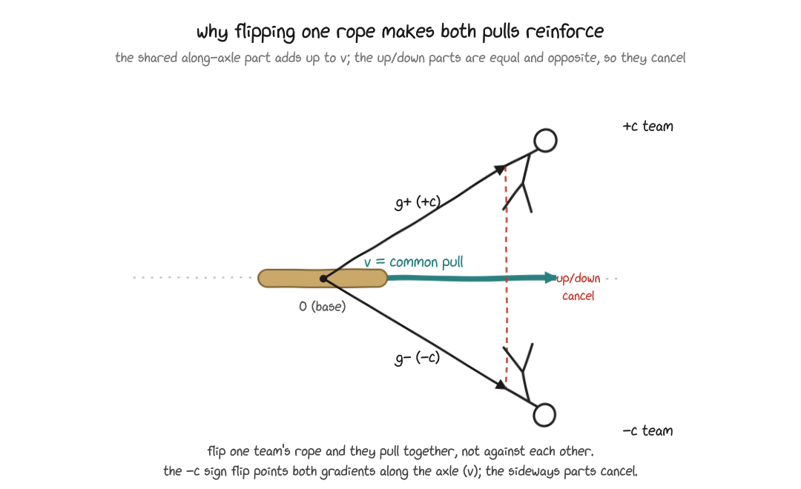

# cwsteer - contrastive weight steering

cwsteer is my tested fork of [contrastive weight steering](https://arxiv.org/abs/2511.05408)
([code](https://github.com/safety-research/weight-steering)). It trains an adapter on
chosen/rejected model completions, calibrates a steering strength, then bakes that
strength into the model weights for inference.

Compared with upstream, this adds one signed adapter instead of two, PiSSA init, KL
control, steering-strength calibration, and pair filtering.



*One adapter learns both directions. We train it under `+c` and `-c` so the two poles
push the shared direction together instead of learning two separate adapters. See the
appendix for the gradient intuition.*

## Status

The repo has a CPU smoke test. `just smoke` runs a tiny random Qwen3 through
adapter init, training, calibration, baking, and weight restore.

Early 0.6B-4B evals ([LW](https://www.lesswrong.com/posts/HYTbakdHpxfaCowYp/steering-language-models-with-weight-arithmetic?commentId=GomjgJDtr5JhEAuC3))
show the thing I care about: controlled movement. The effect is monotonic, uncertainty
is low, answer coherence is good, and surgical informedness beats prompting and several
activation-steering baselines. It is not winning on raw shift yet. Calibration still
needs work. A fuller eval is running.

## Install

```sh
git clone https://github.com/wassname/cwsteer && cd cwsteer
uv sync
uv run python scripts/smoke.py
```

## Quickstart

First choose contrastive personas and prompts. Bad pairs poison training, calibration,
and baking, so validate them before use. I use the
[persona-steering template library](https://github.com/wassname/persona-steering-template-library)
for that.

```python
import torch
from transformers import AutoModelForCausalLM, AutoTokenizer
from cwsteer import AdapterSpec, TrainCfg, baked, train_adapter

model = AutoModelForCausalLM.from_pretrained("...", dtype=torch.bfloat16)
tok = AutoTokenizer.from_pretrained("...")
pairs = [{"prompt": "...", "cho": "...", "rej": "..."}, ...]

lora = train_adapter(model, tok, pairs, TrainCfg(r=16, kl_lambda=0.03))
spec = AdapterSpec.from_lora(lora, default_c=0.8)
with baked(model, [spec]):
    out = model.generate(...)
```

## What this fork adds

- one adapter instead of two ([`adapter.py`](src/cwsteer/adapter.py))
- PiSSA init from the top-r SVD; quantised models use plain LoRA because PiSSA mutates
  the float weight ([`adapter.py`](src/cwsteer/adapter.py))
- KL control to limit drift from the base model ([`train.py`](src/cwsteer/train.py))
- calibration to find a large coherent steering strength ([`c_scan.py`](src/cwsteer/c_scan.py))
- generation-time filtering for persona leakage, refusal, repetition, and weak contrast
  ([`pairs.py`](src/cwsteer/pairs.py))

The signed adapter, KL control, calibration, and pair filtering follow earlier
[AntiPaSTO work](https://arxiv.org/pdf/2601.07473). PiSSA is a separate existing
method. I have not added a standalone post-hoc pair filter yet.

## Why weight steering

Steering is interesting because it can use contrastive prompts instead of reward
labels, and because the intervention is closer to model internals than RL. Activation
steering often works locally, then gets incoherent when pushed. Weight steering gives
up some purity by training on model completions, but in these runs it stays coherent
for longer and composes across rounds.

Weight steering is still less internal than activation steering because it adds an
external objective: NLL over model completions. I do not yet have a good intuition for
what that means for behaviours like sandbagging and reward hacking, where the failure
may be a mismatch between outer logprobs and inner hidden states.

My current intuition
- It's about 2x as good, and 2x as coherent as activation steering (I [tested](https://www.lesswrong.com/posts/HYTbakdHpxfaCowYp/steering-language-models-with-weight-arithmetic?commentId=GomjgJDtr5JhEAuC3) against https://github.com/wassname/steering-lite)
- It needs very little data, ~10-20 clean samples is fine, this is differen't than normal lora training which uses 100-3000+
- My changed here make it more reliable and performant (but other peoples work may come out soon, it's early days), mainly by filtering data, and adding the per-update bidirectionality constraint

## Appendix: adapter sketch

The plain LoRA form, per target Linear:

$$y = x W^\top + c \cdot \frac{\alpha}{r}\,(x A^\top) B^\top$$

`c = 0` gives the base model. `+c` and `-c` are the two poles of one learned
direction. The same pairs are trained under both signs, favouring `cho` at `+c` and
`rej` at `-c`, so one adapter learns the bidirectional axis. At inference, `c`
controls steering strength.

The persona used to elicit the contrast is carried by the completions only, then
stripped before training. It is not part of the deployed adapter.

## Appendix: gradient intuition

Training both signs of `c` is the main trick. Ordinary SFT learns whatever lowers
loss, including things `cho` and `rej` have in common. Here the same adapter is used
under `+c` and `-c`, so the shared component cancels and the separating direction is
reinforced.

That is why this is closer to steering than SFT: the update is constrained to a
bidirectional axis through the base model. It is still not pure activation steering,
because it trains with an external likelihood objective.

## Sources

- Base method: [safety-research/weight-steering](https://github.com/safety-research/weight-steering)
- Adapter pattern: [lora-lite](https://github.com/wassname/lora-lite)
